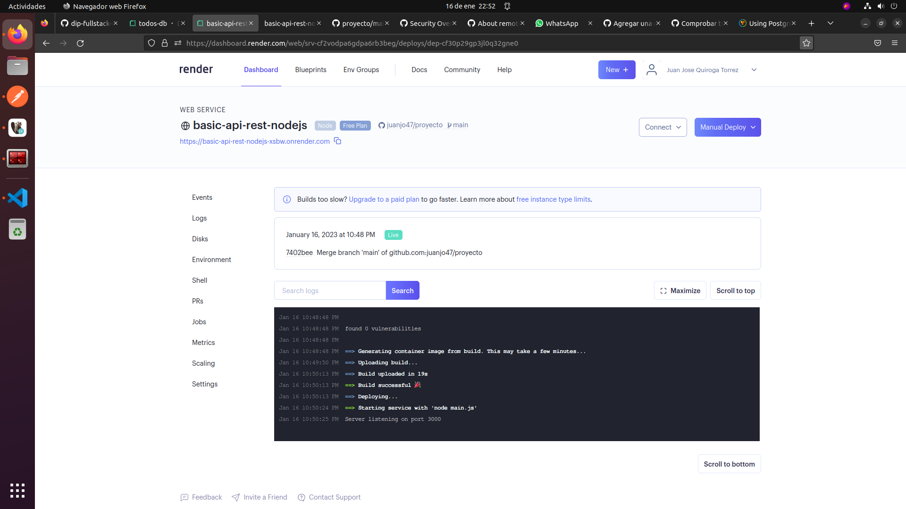
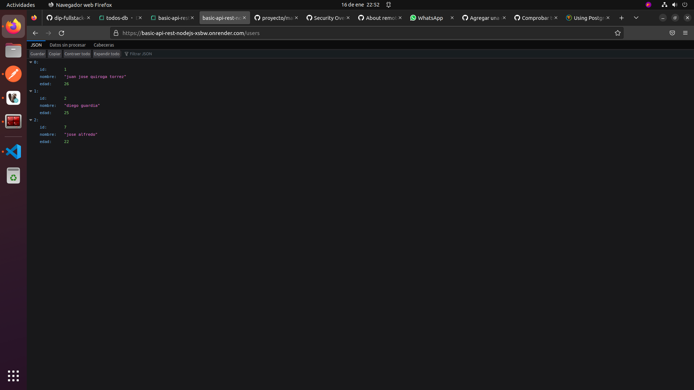
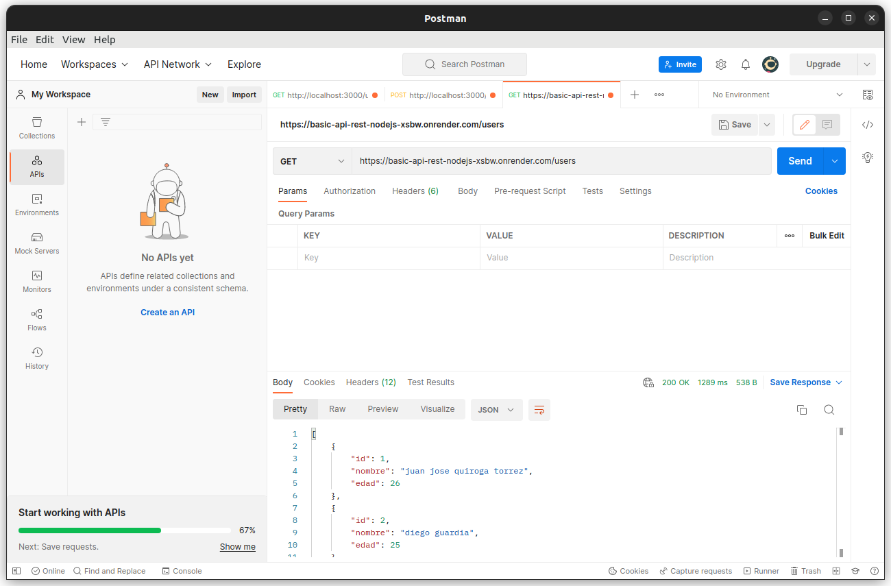
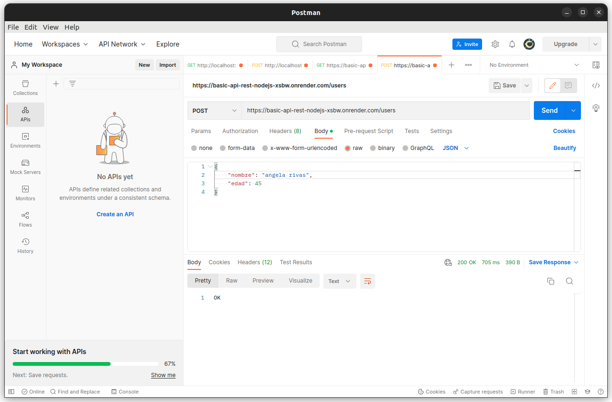
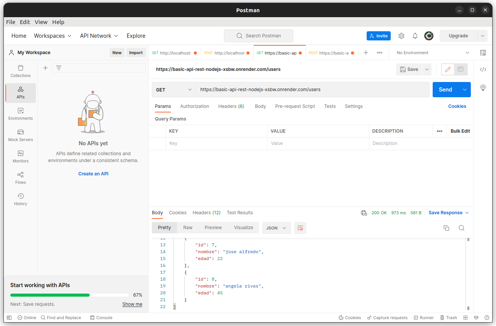

# Proyecto Modulo 3
## link de proyecto levantado
https://basic-api-rest-nodejs-xsbw.onrender.com
## APIs
<ul>
<li>GET en local: http://localhost:3000/users</li>
<li>POST en local: http://localhost:3000/users</li>
<li>GET en web: https://basic-api-rest-nodejs-xsbw.onrender.com/users</li>
<li>POST en web: https://basic-api-rest-nodejs-xsbw.onrender.com/users</li>
</ul>

### sintaxys post
``
{
    "nombre": "angela rivas",
    "edad": 45
}
``
## Imagenes del proyecto funcionando

